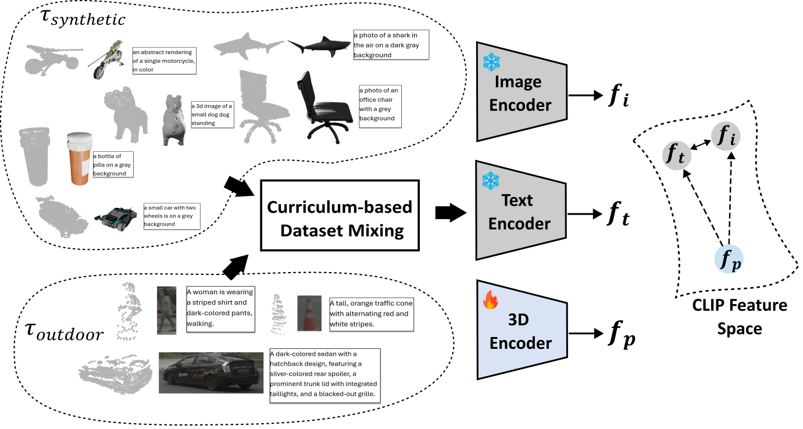
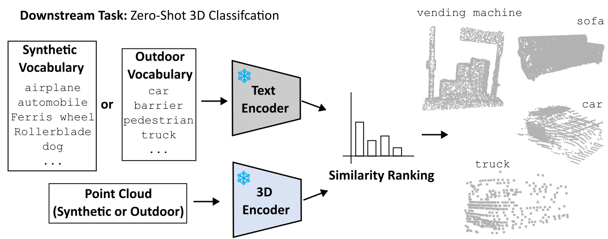

# BlendCLIP: Bridging Synthetic and Real Domains for Zero-Shot 3D Object Classification with Multimodal Pretraining

<p align="center">
  
</p>

<p align="center">
  
</p>

> [arXiv](https://arxiv.org/abs/2510.18244) 

BlendCLIP is a multimodal pretraining framework that **bridges this synthetic-to-real gap** by strategically combining the strengths of both domains.
It introduces a **curriculum-based data mixing strategy** that leverages large-scale synthetic CAD models while simultaneously benefitting from real-world data.

---

## 🚀 Highlights

- **Curriculum-based Data Mixing**
Grounds the model in the semantically rich synthetic
data before progressively adapting it to the specific characteristics of real-world scans.

- **Truly Zero-Shot 3D Object Classification**
Generalizes not only to unseen classes but also to unseen domains, achieving state-of-the-art zero-shot performance on autonomous driving datasets.

- **Outdoor Triplets Dataset**
Describes a pipeline to create multimodal *(3D-image-text)* object-centric dataset from outdoor autonomous driving data.

---

## 📦 Code Availability

🚧 **Code is coming soon!**  
We will release the full training and inference pipeline along with the created outdoor triplet dataset  upon acceptance.
Stay tuned and watch this repository for updates.

---

## 📑 Citation

If you find this work useful, please cite:

```bibtex
@misc{khoche2025blendclipbridgingsyntheticreal,
      title={BlendCLIP: Bridging Synthetic and Real Domains for Zero-Shot 3D Object Classification with Multimodal Pretraining}, 
      author={Ajinkya Khoche and Gergő László Nagy and Maciej Wozniak and Thomas Gustafsson and Patric Jensfelt},
      year={2025},
      eprint={2510.18244},
      archivePrefix={arXiv},
      primaryClass={cs.CV},
      url={https://arxiv.org/abs/2510.18244}, 
}