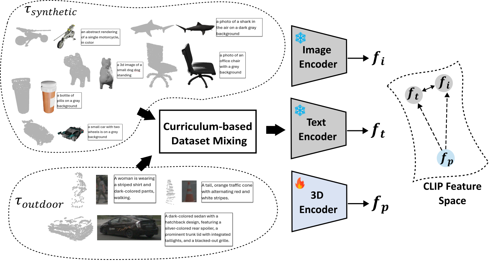
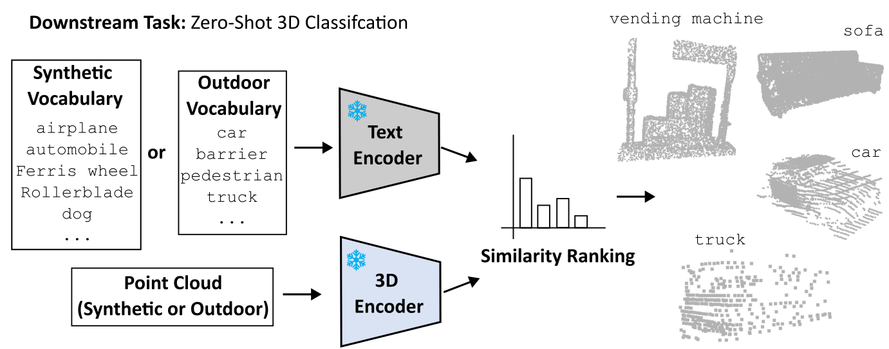

# BlendCLIP: Bridging Synthetic and Real Domains for Zero-Shot 3D Object Classification with Multimodal Pretraining

<p align="center">
  
</p>

<p align="center">
  
</p>

**Paper:** [ [arXiv](https://arxiv.org/abs/2510.18244) ] · [ [CVF](https://openaccess.thecvf.com/content/WACV2026/papers/Khoche_BlendCLIP_Bridging_Synthetic_and_Real_Domains_for_Zero-Shot_3D_Object_WACV_2026_paper.pdf) ]

BlendCLIP is a multimodal pretraining framework that **bridges this synthetic-to-real gap** by strategically combining the strengths of both domains.
It introduces a **curriculum-based data mixing strategy** that leverages large-scale synthetic CAD models while simultaneously benefitting from real-world data.

---

## 🚀 Highlights

- **Curriculum-based Data Mixing**
Grounds the model in the semantically rich synthetic
data before progressively adapting it to the specific characteristics of real-world scans.

- **Truly Zero-Shot 3D Object Classification**
Generalizes not only to unseen classes but also to unseen domains, achieving state-of-the-art zero-shot performance on autonomous driving datasets.

- **Outdoor Triplets Dataset**
Describes a pipeline to create multimodal *(3D-image-text)* object-centric dataset from outdoor autonomous driving data.

---

## 💻 Code

This repository contains the official implementation of our WACV 2026 paper, including code for reproducing the experiments.


## ⚙️ Instructions

### Triplets Dataset Creation

To create triplet datasets from nuScenes and TruckScenes from scratch, create the `triplets` conda environment:

```console
conda env create --file environment_configs/environment_triplets.yaml
```

Relevant scripts are available in the `data/dataset_triplets` directory.

### Pretraining and Experiments

To run the model pretraining, reproduce ablations, and evaluation experiments, create the `triplets` conda environment:

```console
conda env create --file environment_configs/environment_blendclip.yaml
```

Relevant scripts are available in the `scripts` directory.

---

## 📦 Triplet Datasets Availability

Coming soon to 🤗 Hugging Face!

---

## 📑 Citation

If you find this work useful, please cite:

```bibtex
@inproceedings{khoche2026blendclip,
      title={BlendCLIP: Bridging Synthetic and Real Domains for Zero-Shot 3D Object Classification with Multimodal Pretraining},
      author={Khoche, Ajinkya and Nagy, Gergő László and Wozniak, Maciej and Gustafsson, Thomas and Jensfelt, Patric},
      booktitle={Proceedings of the IEEE/CVF Winter Conference on Applications of Computer Vision},
      pages={5766--5775},
      year={2026}
}
```